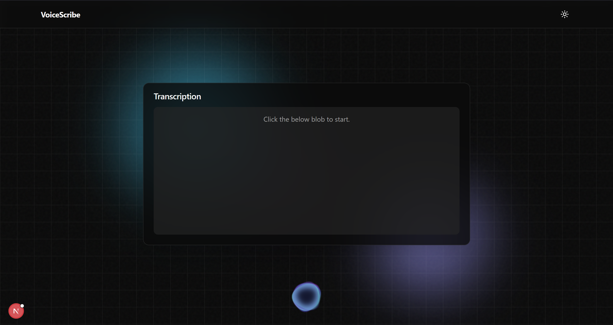

# VoiceScribe

A modern voice transcription application with real-time audio visualization. This project allows users to record audio, transcribe it using Groq's AI models, and visualize the audio waveform in real-time.



**[Try it live](https://voice-agent-alpha-six.vercel.app/)**

## Tech Stack


## Features

- **Real-time Audio Recording**: Capture audio directly from your browser
- **Audio Visualization**: See your voice visualized in real-time as you speak
- **AI-Powered Transcription**: Convert speech to text using Groq's Whisper model
- **Copy & Download**: Easily copy or download your transcriptions
- **Dark/Light Mode**: Toggle between themes for comfortable viewing
- **Responsive Design**: Works on desktop and mobile devices

## Getting Started

### Prerequisites

- Node.js 18.x or higher
- npm or yarn

### Installation

1. **Clone the repository**:

```bash
git clone https://github.com/lazyjinchuriki/voice-scribe.git
cd voice-scribe
```

2. **Install dependencies**:

```bash
npm install
# or
yarn install
```

3. **Set up environment variables**:

Create a `.env.local` file in the root directory with the following:

```env
NEXT_PUBLIC_GROQ_API_KEY=your_groq_api_key
```

You can get a free Groq API key by signing up at [Groq AI Platform](https://console.groq.com/).

4. **Run the development server**:

```bash
npm run dev
# or
yarn dev
```

Open [http://localhost:3000](http://localhost:3000) with your browser to see the application.

## Usage

1. Click the microphone button to start recording
2. Speak clearly into your microphone
3. Click the stop button when finished
4. Wait for the transcription to process
5. Copy or download your transcription as needed

## Deployment

This application can be easily deployed on Vercel:

[](https://vercel.com/new/clone?repository-url=https%3A%2F%2Fgithub.com%2Fyourusername%2Fvoice-scribe)

Make sure to add your Groq API key to the environment variables in your Vercel project settings.

## Contributing

Contributions are welcome! Please feel free to submit a Pull Request.

## Support

If you found this project helpful, consider supporting me:

<a href="https://www.buymeacoffee.com/lazyjinchuriki">
  
</a>

## Social

Follow me on my social channels for more updates:

[](https://www.instagram.com/amundaneguy/)
[](https://www.linkedin.com/in/rahul-khushalani-77ab21201/)

## Contact

If you have any questions or feedback, feel free to reach out at [rahulkhushalani@proton.me](mailto:rahulkhushalani@proton.me).

## License

This project is licensed under the MIT License - see the LICENSE file for details.
